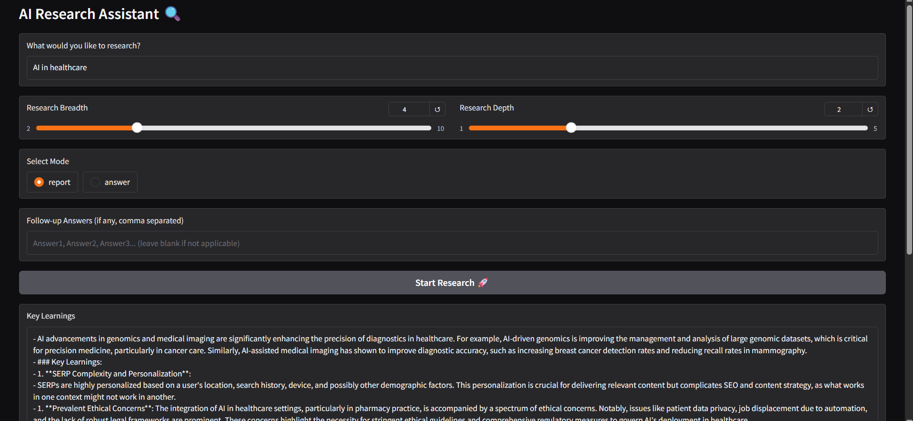

# 🔍 Deep Research (Python Edition)
---
Deep Research is a command-line tool that automates recursive web research using SERP queries, scraping, and LLM summarization. It’s built using FastAPI, Python, and integrates with Firecrawl and OpenAI.

---

## 🧠 Features

- Iterative multi-query deep research
- Follow-up question generator
- Async Firecrawl search + markdown extraction
- Works with OpenAI, local endpoints, or Fireworks (DeepSeek R1)
- Outputs: Final answer or long-form report
- API & CLI support

---

 

## 🌟 Key Features

- **Intelligent Research Automation**
  - Multi-level recursive research with adjustable depth/breadth
  - Dynamic follow-up question generation
  - Context-aware result synthesis

- **Flexible Integration**
  - Supports OpenAI, local LLM endpoints, and Fireworks (DeepSeek R1)
  - Async Firecrawl search with markdown content extraction
  - Both API (FastAPI) and CLI interfaces

- **Customizable Outputs**
  - Concise answers for quick insights
  - Detailed long-form reports with citations
  - Markdown format for easy integration

## 🚀 Quick Start

### Prerequisites
- Python 3.10+
- API keys (see configuration below)
- (Optional) Docker + docker-compose for containerized deployment

### Installation

1. Clone the repository:
```bash
git clone https://github.com/yourname/deep-research.git
cd deep-research
```

2. Set up environment:
```bash
cp .env.template .env  # Update with your API keys
python -m venv venv
source venv/bin/activate  # Linux/Mac
venv\Scripts\activate    # Windows
pip install -r requirements.txt
```

### Usage Options

#### CLI Version
```bash
python main.py
```
Follow the interactive prompts to conduct your research.

#### Gradio Web Interface
```bash
python main_gradio.py
```
Access the intuitive web UI at `http://localhost:7860`

#### API Mode
```bash
uvicorn api:app --reload
```
Access API documentation at `http://localhost:8000/docs`

## ⚙️ Configuration

Edit the `.env` file with your API keys:

```ini
OPENAI_API_KEY=your_key_here
FIRECRAWL_API_KEY=your_key_here
# Optional alternative providers:
# ANTHROPIC_API_KEY=...
# FIREWORKS_API_KEY=...
```

## 📚 Documentation

### Research Parameters
| Parameter  | Description                          | Range    | Default |
|------------|--------------------------------------|----------|---------|
| Breadth    | Number of parallel research threads  | 2-10     | 4       |
| Depth      | Recursive research levels           | 1-5      | 2       |
| Mode       | Output format                       | report/answer | report |

### Advanced Features
- Custom prompt engineering via `prompts.py`
- URL filtering rules in `scraping.py`
- Output templates in `report.py`

## 🌐 API Reference

The FastAPI server provides these endpoints:

- `POST /research` - Start a new research task
- `GET /status/{task_id}` - Check research progress
- `GET /results/{task_id}` - Retrieve completed research

